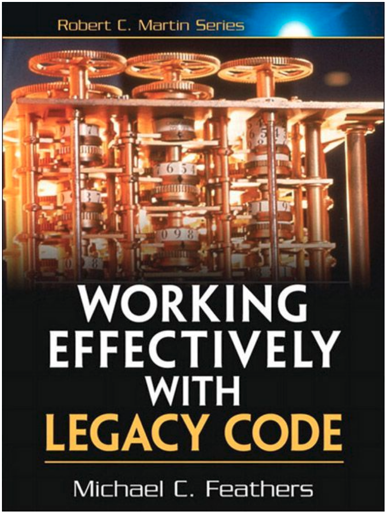
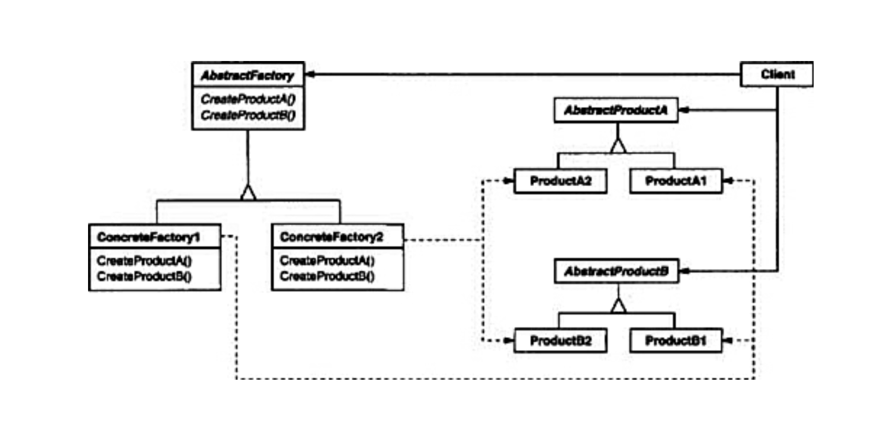

<script type="text/x-mathjax-config">
  MathJax.Hub.Config({
    tex2jax: {
      inlineMath: [ ['$','$'], ["\\(","\\)"] ],
      processEscapes: true
    }
  });
</script>

<script type="text/javascript"
  src="https://cdn.mathjax.org/mathjax/latest/MathJax.js?config=TeX-AMS-MML_HTMLorMML">
</script>
# Pythonizing workflows 
## with modern and legacy chemistry softwares

### EuroSciPy2018

### Olav Vahtras 

#### https://vahtras.github.io/euroscipy2018

---

layout: false

## About <a href="https://www.kth.se/profile/vahtras">me</a>

* KTH Royal Institute of Technology

* Professor of Theoretical Chemistry
* Software Carpentry/Data Carpentry

* Co-editor of <a href="http://www.scipy-lectures.org/">SciPy Lecture Notes</a>
* Teaching Python at master and Ph.D. levels

---

## What we do


---

## What we do in practice

* Solve large eigenvalue equations

$$
Ax = \lambda x
$$

* Solve large linear systems of equations

$$
Ax = b
$$


* Typical dimension $10^6$
* Matrix too large to store
* Solved by iteration

---

## Our codes

### Some old

* The Dalton project http://www.daltonprogram.org
* Research development tool since 1980s
* Mostly Fortran
* Some C/C++
* $\gt 10^6$ *SLOC*
* Open-source since 2016

<div class="col-md-6"></div>
<div class="col-md-6">

</div>


---

### History

* Successful Scandinavian collaboration
* Code has evolved organically over > 30 years

---

### Problems

* No unit tests
* A number of (long) end to end tests
* Difficult to modify
* Many common blocks

--



--

### However

* A lot of man-years invested
* A lot of functionality that will never be reimplemented
* Code will not go away
* Still ok for teaching

---

## Some new

* Under development
* Modern C++ implementations with MPI/OpenMP/CUDA


---

# Under a Python umbrella



*From <a href="https://www.amazon.com/Design-Patterns-Object-Oriented-Addison-Wesley-Professional-ebook/dp/B000SEIBB8">Design Patterns</a>, Gamma, Helm, Johnson and Vlissies*

* A Python abstraction layer that provides functionality 
* Allows for communication and exchange of data between submodules

---

## High level 

* Managing legacy monolithic code  : Python glue
* Generating input files
* Execute program
* Extract data

---

## Intermediate level

* Manage MPI from the Python layer 
* Split the communicator over different computational parts
* Possibility to divide problem to optimize scaling


---
```
from mpi4py import MPI 

comm = MPI.COMM_WORLD
rank, size = comm.Get_rank(), comm.Get_size()

# Split the communicator in groups of four

sub_group =rank // 4
sub_comm = MPI.Comm.Split(comm, sub_group, rank)
sub_rank, sub_size  = sub_comm.Get_rank(), sub_comm.Get_size()

print(f"World {rank}({size}) Subgroup {sub_group}:{sub_rank}({sub_size})")
sub_comm.Disconnect()
```
```
$ /usr/bin/mpirun -n 8 python3 split_mpi.py
World 0(8) Subgroup 0:0(4)
World 1(8) Subgroup 0:1(4)
World 2(8) Subgroup 0:2(4)
World 3(8) Subgroup 0:3(4)
World 4(8) Subgroup 1:0(4)
World 5(8) Subgroup 1:1(4)
World 6(8) Subgroup 1:2(4)
World 7(8) Subgroup 1:3(4)
```
---

```
#hello.py: passing communicator from Python to Fortran
from mpi4py import MPI
import helloworld

comm = MPI.COMM_WORLD
rank = comm.Get_rank()

fcomm = comm.py2f()
helloworld.sayhello(fcomm)
```

```
!helloworld.f90
subroutine sayhello(comm)

use mpi
implicit none
integer :: comm, rank, size, ierr
call MPI_Comm_size(comm, size, ierr)
call MPI_Comm_rank(comm, rank, ierr)
print *, 'Hello, World! I am process ',rank,' of ',size,'.'
  
end subroutine sayhello
```
```
$ /usr/bin/mpirun -n 4 python3 hello.py
```

---

## Summary and outlook

* On-going work
* Python as a glue between compiled codes
* High- and medium-level logic in Python
* Low-level numerical work in (C++ Boost) or Fortran (f2py)
* Combination of pytest and Google unit testing

To be continued...
